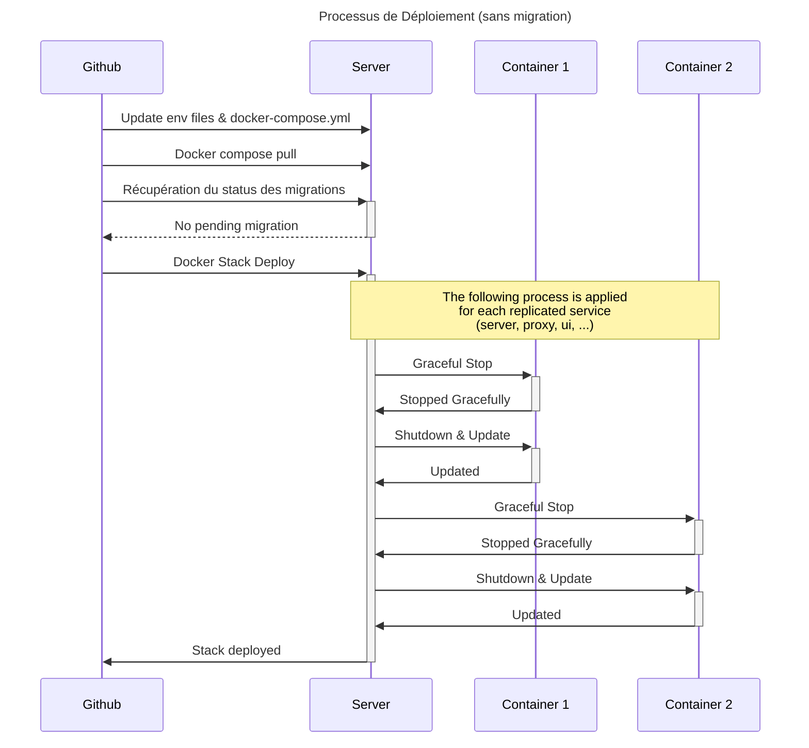
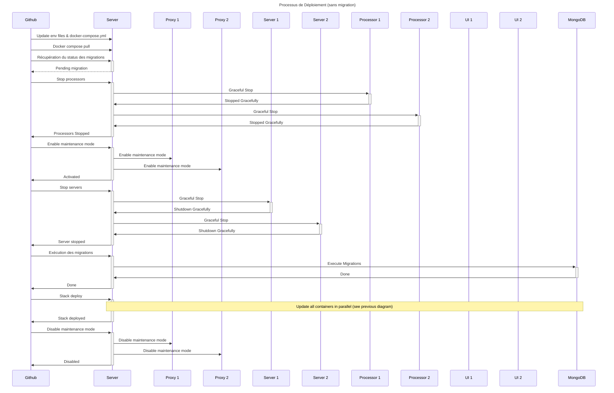
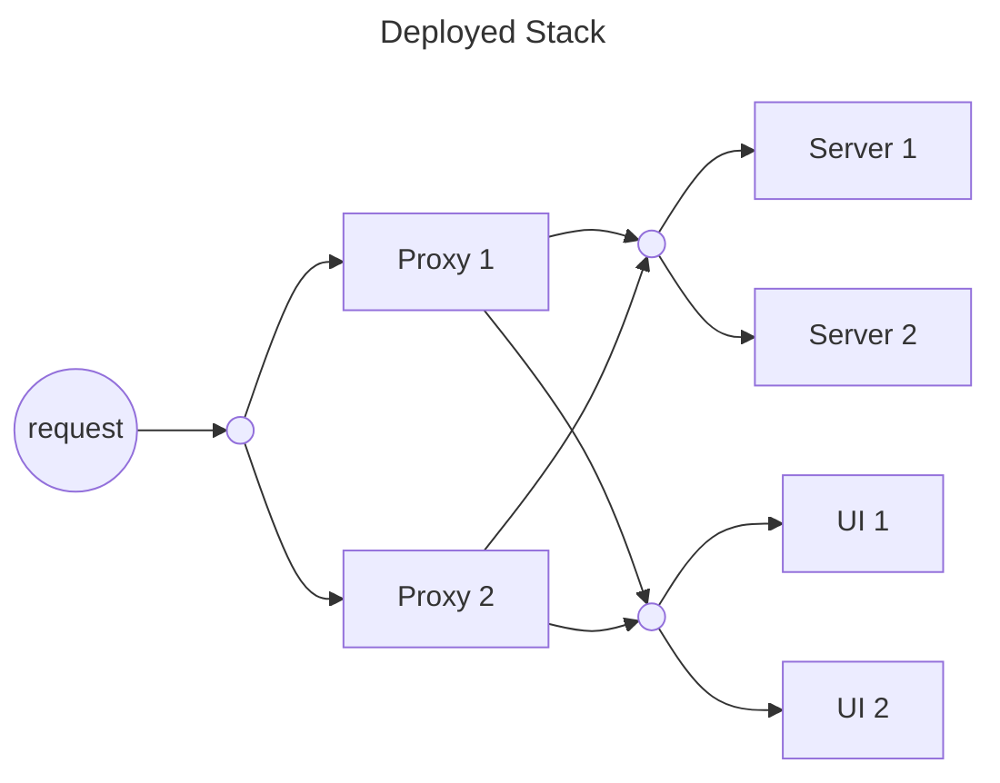
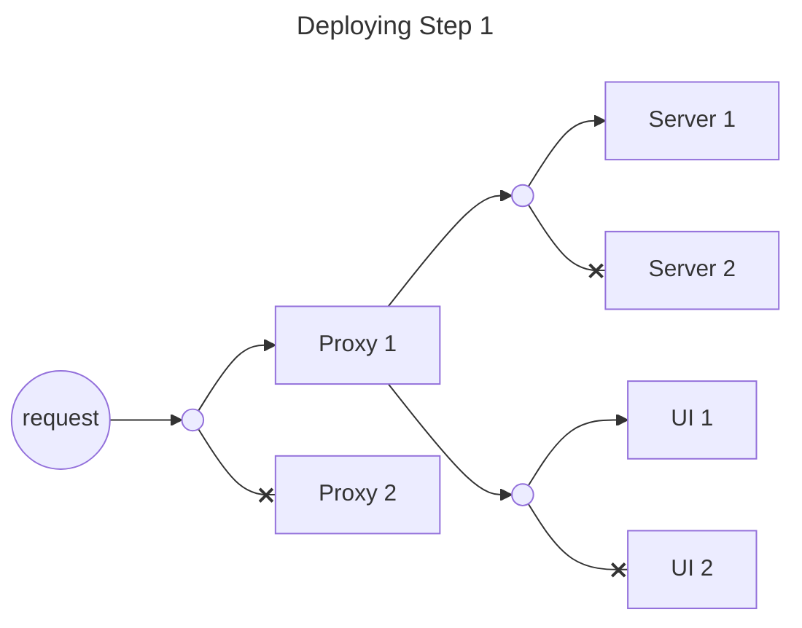
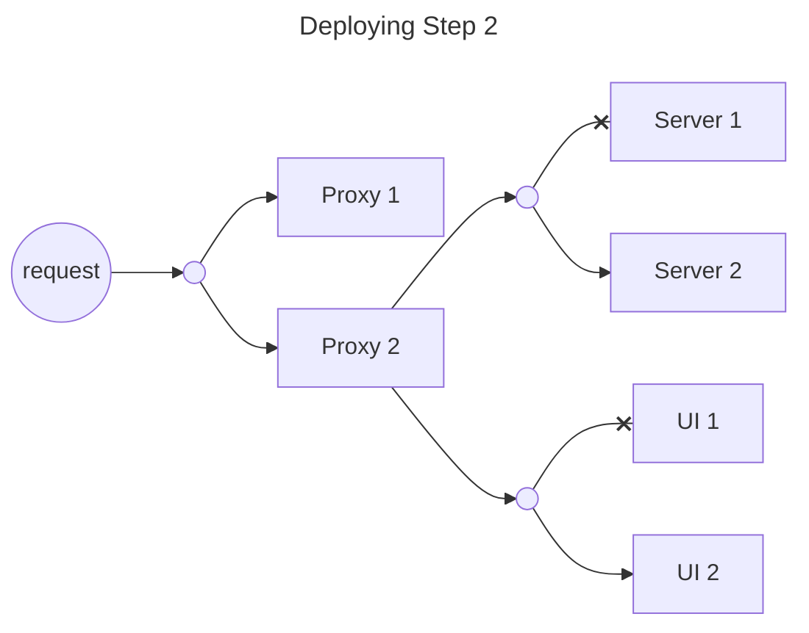

```mermaid
sequenceDiagram
    title Processus de Déploiement (sans migration)
    Github->>Server: Update env files & docker-compose.yml
    Github->>Server: Docker compose pull
    Github->>+Server: Récupération du status des migrations
    Server-->>-Github: No pending migration
    Github->>+Server: Docker Stack Deploy

    participant C1 as Container 1
    participant C2 as Container 2
    Note over Server,C2: The following process is applied<br/> for each replicated service<br/> (server, proxy, ui, ...)

    Server->>+C1: Graceful Stop
    C1->>-Server: Stopped Gracefully
    Server->>+C1: Shutdown & Update
    C1->>-Server: Updated
    Server->>+C2: Graceful Stop
    C2->>-Server: Stopped Gracefully
    Server->>+C2: Shutdown & Update
    C2->>-Server: Updated

    Server->>-Github: Stack deployed
```

```mermaid
sequenceDiagram
    title Processus de Déploiement (sans migration)
    Github->>Server: Update env files & docker-compose.yml
    Github->>Server: Docker compose pull
    Github->>+Server: Récupération du status des migrations
    Server-->>-Github: Pending migration

    participant N1 as Proxy 1
    participant N2 as Proxy 2

    participant S1 as Server 1
    participant S2 as Server 2

    participant P1 as Processor 1
    participant P2 as Processor 2

    participant U1 as UI 1
    participant U2 as UI 2

    Github->>+Server: Stop processors
    Server->>+P1: Graceful Stop
    P1->>-Server: Stopped Gracefully
    Server->>+P2: Graceful Stop
    P2->>-Server: Stopped Gracefully
    Server->>-Github: Processors Stopped

    Github->>+Server: Enable maintenance mode
    Server->>N1: Enable maintenance mode
    Server->>N2: Enable maintenance mode
    Server->>-Github: Activated

    Github->>+Server: Stop servers
    Server->>+S1: Graceful Stop
    S1->>-Server: Shutdown Gracefully
    Server->>+S2: Graceful Stop
    S2->>-Server: Shutdown Gracefully
    Server->>-Github: Server stopped

    Github->>+Server: Exécution des migrations
    Server->>+MongoDB: Execute Migrations
    MongoDB->>-Server: Done
    Server->>-Github: Done


    Github->>+Server: Stack deploy
    Note over Server,MongoDB: Update all containers in parallel (see previous diagram)
    Server->>-Github: Stack deployed

    Github->>+Server: Disable maintenance mode
    Server->>N1: Disable maintenance mode
    Server->>N2: Disable maintenance mode
    Server->>-Github: Disabled
```

```mermaid
---
title: Deployed Stack
---
flowchart LR
    entry((request))
    entry-->D1(( ))
    D1-->P1[Proxy 1]
    D1-->P2[Proxy 2]
    P1-->D2(( ))
    P2-->D2(( ))
    D2-->S1[Server 1]
    D2-->S2[Server 2]
    P1-->D3(( ))
    P2-->D3(( ))
    D3-->U1[UI 1]
    D3-->U2[UI 2]

```

```mermaid
---
title: Deploying Step 1
---
flowchart LR
    entry((request))
    entry-->D1(( ))
    D1-->P1[Proxy 1]
    D1--xP2[Proxy 2]
    P1-->D2(( ))
    D2-->S1[Server 1]
    D2--xS2[Server 2]
    P1-->D3(( ))
    D3-->U1[UI 1]
    D3--xU2[UI 2]
```

```mermaid
---
title: Deploying Step 2
---
flowchart LR
    entry((request))
    entry-->D1(( ))
    D1-->P1[Proxy 1]
    D1-->P2[Proxy 2]
    P2-->D2(( ))
    D2--xS1[Server 1]
    D2-->S2[Server 2]
    P2-->D3(( ))
    D3--xU1[UI 1]
    D3-->U2[UI 2]
```
