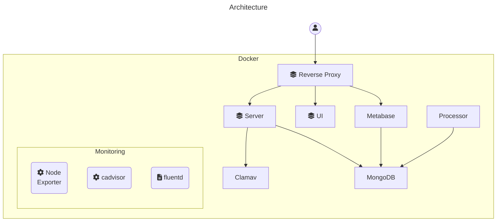
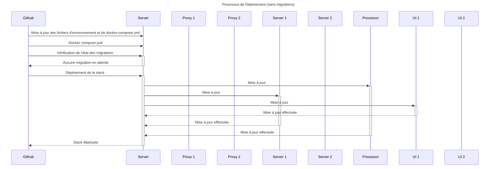

# Architecture

## Infrastructure

L'infrastructure repose sur [Docker Swarm](https://docs.docker.com/engine/swarm/) afin d'assurer un déploiement sans interruption de service grâce notamment à:

- La prise en charge de la réplication des services (plusieurs conteneurs par service)
- Un équilibreur de charge intégré qui répartit les requêtes sur les différents conteneurs (load-balanceur)

De plus, il est possible de distribuer la stack sur différents serveurs (appelés nœuds), ce qui pourrait être utilisé pour répondre à une augmentation de la charge du serveur et aux besoins de haute disponibilité (high-availability).

Voici une représentation de la stack en production. Les services Reverse Proxy, Server et UI sont chacun constitués de 2 conteneurs pour assurer le déploiement sans interruption de service.



## Releases

Les services Docker Swarm doivent nécessairement utiliser des images disponibles dans un registry, et non se baser directement sur les Dockerfile (contrairement à Docker Compose). Cela s'explique par le fait que Docker Swarm peut être distribué sur plusieurs serveurs.

Lors d'un push sur la branche "main", la Github Action exécute la release qui effectue les actions suivantes :

- Mise à jour des versions du Server et de l'UI dans les fichiers package.json respectifs
- Build les images dockers du Server et de l'UI
- Push les images sur le Gihhub Docker Registry
- Push le changelog et le tag de version sur Github

## Déploiement

Le déploiement est déclenché manuellement à partir des Github Actions.

On peut différencier 2 types de déploiements : avec et sans migrations de la base de données.

### Sans Migrations

Lorsqu'il n'y a pas de migrations, le déploiement s'effectue sans interruption de service.

Le déploiement se base sur la commande [docker stack deploy](https://docs.docker.com/engine/reference/commandline/stack_deploy/).

Dans le fichier [docker-compose.yml](../.infra/docker-compose.yml) qui décrit la stack déployée par Docker Swarm, on trouve les configurations suivantes:

- `deploy.update_config.parallelism=1`: lors de l'application d'une mise à jour du service, Docker Swarm exécute la mise à jour conteneur par conteneur.
- `deploy.replicas=2`: certains services sont répliqués sur plusieurs conteneurs. Ainsi, lors de l'application de la mise à jour (qui nécessite l'arrêt du conteneur), il existe toujours au moins un conteneur assurant le service.



- Les modifications des services Proxy, Server, Processor et UI se font sans interruption.
- **Cependant, les modifications des services MongoDB et Clamav se traduisent par une interruption de service.**

#### Avec Migration

Le déploiement sans interruption de service est théoriquement possible, mais exige une extrême rigueur de la part des développeurs lors des changements du modèle de données.

Ni la mise à jour d'un conteneur ni la migration ne sont instantanées (non atomiques), donc pour assurer un déploiement sans interruption, il faut soit que :

- Le nouveau modèle de données soit compatible avec la version précédente de l'application.
- La nouvelle version soit compatible avec la version précédente du modèle de données.

Étant donné que les changements du modèle de données sont rares, il est acceptable ici d'interrompre le service lors du déploiement.

Lors d'un changement du modèle de données, il est important d'arrêter tous les services qui modifient les données.

```mermaid
sequenceDiagram
    title Processus de Déploiement (avec migrations)
    Github->>Server: Mise à jour des fichiers d'environnement et de docker-compose.yml
    Github->>Server: Docker compose pull
    Github->>+Server: Vérification de l'état des migrations
    Server-->>-Github: Migrations en attente

    participant N1 as Proxy 1
    participant N2 as Proxy 2

    participant S1 as Server 1
    participant S2 as Server 2

    participant P as Processor

    participant U1 as UI 1
    participant U2 as UI 2

    Github->>+Server: Arrêt des processors
    Server->>+P: Arrêt
    P-->>-Server: Arrêté
    Server-->>-Github: Processors arrêtés

    Github->>+Server: Activation du mode de maintenance
    Server->>N1: Activation du mode de maintenance
    Server->>N2: Activation du mode de maintenance
    Server-->>-Github: Activé

    Github->>+Server: Arrêt des serveurs
    Server->>+S1: Arrêt
    S1-->>-Server: Arrêté
    Server->>+S2: Arrêt
    S2-->>-Server: Arrêté
    Server-->>-Github: Serveur arrêté

    Github->>+Server: Exécution des migrations
    Server->>+MongoDB: Exécution des migrations
    MongoDB-->>-Server: Terminé
    Server-->>-Github: Terminé

    Github->>+Server: Déploiement de la stack
    Remarque au-dessus de Server,MongoDB: Mise à jour de tous les conteneurs en parallèle (voir diagramme précédent)
    Server-->>-Github: Stack déployée

    Github->>+Server: Désactivation du mode de maintenance
    Server->>N1: Désactivation du mode de maintenance
    Server->>N2: Désactivation du mode de maintenance
    Server-->>-Github: Désactivé

```

### Healthcheck

Le healthcheck docker est utilisé pour:

- Relancer le service en cas d'erreur.
- Assurrer le déploiement sans interruption.

Dans le cadre du déploiement sans interruption, par défaut, Docker considère que le service est lancé lorsque la commande est exécutée et non lorsque le processus est prêt à accepter des requêtes (par exemple, le lancement du serveur peut prendre plusieurs secondes pour établir la connexion à MongoDB, l'initialisation du serveur, etc.).

Le healthcheck permet donc de s'assurer que le premier conteneur est prêt avant de procéder à la mise à jour du conteneur suivant.

### Graceful Shutdown

**Non supporté actuellement**

Lors de l'arrêt d'un conteneur, Docker envoie un `SIGTERM`, puis après un délai (par défaut 10 secondes), il envoie un `SIGKILL`.

Il est important de ne pas interrompre les requêtes en cours. Pour cela, il est nécessaire de :

- Adapter la période d'arrêt en douceur ([stop_grace_period](https://docs.docker.com/compose/compose-file/compose-file-v3/#stop_grace_period)) en fonction des services pour laisser suffisamment de temps pour terminer les tâches en cours.
- Écouter le signal `SIGTERM` dans les différentes applications pour terminer les tâches en cours et s'arrêter correctement.
